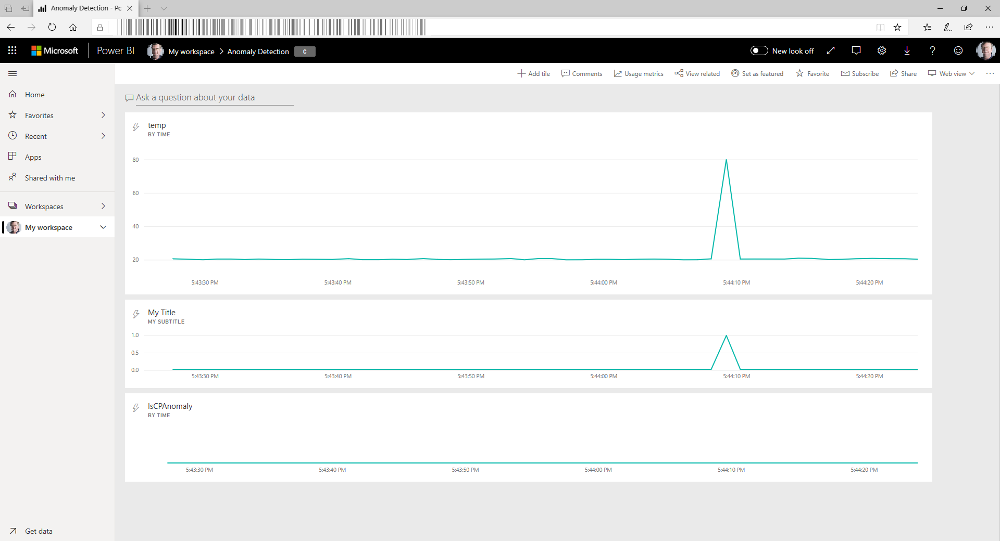

# Demo of Anomaly Detection with Azure Stream Analytics using the DASimulator

This demo allows you to show anomaly detection using a Azure Stream Analytics Job. Unfortunately it is not possible to feed data into an Edge Device to show a local ASA Job in action, but the process will be exactly the same for physical sensors, an edge device and a local ASA job.

Some background on Anomaly Detection using ASA can be found in [this document](https://azure.microsoft.com/en-us/blog/anomaly-detection-using-built-in-machine-learning-models-in-azure-stream-analytics/).

The Device Simulator we are using is published on [GitHub](https://github.com/Azure/azure-stream-analytics/tree/master/Samples/DeviceSimulator) and can also be used by attendees to experiment with ASA Anomaly Detection.

## Pre-requisites

Have this ready before showing the demo:

### Create and setup the Stream Analytics Job
1) An IoT Hub with an entry for the DASimulator
1) Initialize the DASimulator with the IoT Hub name and device access key
1) An Azure Screen Analytics Job taking input from the DASimulator via IoT Hub and sending output to Power BI
1) Make sure that the Stream Analytics Job is started
1) The Azure Screen Analytics Job should have the following Query defined:
```SQL
WITH AnomalyDetectionStep AS 
(
    SELECT
        EVENTENQUEUEDUTCTIME as time,    
        sensorId,
        CAST(temperature as float) as temp,  
        AnomalyDetection_SpikeAndDip(temperature, 95, 120, 'spikesanddips') OVER(LIMIT DURATION(ss, 120)) as SDscores,
        AnomalyDetection_ChangePoint(temperature, 80, 120) OVER(LIMIT DURATION(ss, 120)) as CPscores
    FROM ADSimulatorInput
) 
 
SELECT
    time,   
    temp,   
    CAST(GetRecordPropertyValue(SDscores, 'Score') as float) as SDScore,
    CAST(GetRecordPropertyValue(SDscores, 'IsAnomaly') as bigint) as IsSDAnomaly,
    CAST(GetRecordPropertyValue(CPscores, 'Score') as float) as CPScore,
    CAST(GetRecordPropertyValue(CPscores, 'IsAnomaly') as bigint) as IsCPAnomaly

INTO
    OutputPowerBI
FROM
    AnomalyDetectionStep
```


### Create the PowerBI Dashboard
1) Create a Power BI dashboard, showing temp, IsSDAnomaly and IsCPAnomaly over time. Also experiment a bit with showing some of these as live KPIs as well.



## DEMO Time
1) Start the DASimulator
1) Show the PowerBI Dashboard
1) Play with the DASimulator to show some anomalies

NOTE: Make sure to stop the Azure Stream Job to limit charges to your subscription.

