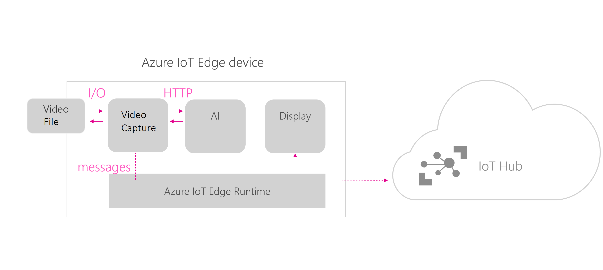

# Custom Vision on Azure IoT Edge
## Introduction
This demo can be executed on a physical device (as small as a Raspberry Pi) or on a virtual device, for instance an Ubuntu IoT Edge Azure VM.

The demo literally follows the [following sample](https://azure.microsoft.com/en-us/resources/samples/custom-vision-service-iot-edge-raspberry-pi/). Just build for the right environment and you should be good to go. However, step-by-step instructions are also included in this document if you want to run the demo on a Linux VM.

If you are running the demo on a virtual device, it makes sense to show the video stream that we are using to recognize apples and banana's. Also, the interesting messages are when banana's are tilted out for apples. At that moment you will see some uncertainty in the model.

The following instructions can be used to prepare this demo for running on a generic Linux machine (or VM).

## Architecture Overview and Modules Used
### Modules
This solution is made of 2 modules:
1) Camera capture - this module captures the video stream from a file, sends the frames for analysis to the custom vision module and shares the output of this analysis to the edgeHub.
1) Custom vision - it is a web service over HTTP running locally that takes in images and classifies them based on a custom model built via the Custom Vision website. This module has been exported from the Custom Vision website. 
Communication between modules
This is how the modules communicate between themselves and with the cloud:

## Preparing the demo (estimated time approx. 45 minutes)
### Tools
To run this demo, you need the following devevelopment tools installed on your laptop:
- Visual Studio Code: IoT Edge development environment. Download it [from here](https://code.visualstudio.com/).
- Visual Studio Code: Azure IoT Edge Extension: An extension that connects to your IoT Hub and lets you manage your IoT Devices and IoT Edge Devices right from VS Code. Download it [from here](https://marketplace.visualstudio.com/items?itemName=vsciot-vscode.azure-iot-edge).
- IoT Edge target device (physical or virtual running Linux or Windows). The description is based on running Azure IoT Edge inside an Azure VM. Here you can find a [step-by-step instructions](https://docs.microsoft.com/en-us/azure/iot-edge/how-to-install-iot-edge-linux) to set up the IoT Edge runtime on an existing Linux device or VM. If you don't have a target device, you can create one and install the Azure IoT Edge runtime from [the Azure Marketplace](https://docs.microsoft.com/en-us/azure/iot-edge/how-to-install-iot-edge-ubuntuvm).
### Installing the Demo Containers
Since initially this is a time consuming job, you will build, install and test the necessary modules prior to showing them in action.

These steps need to be executed on your development machine:
1) Clone [this sample](https://github.com/Azure-Samples/Custom-vision-service-iot-edge-raspberry-pi/tree/master/) (if you don't want to clone the sample to your local machine, you can clone it to your target device and use VS Code remote tools to build the sample on your target device). Setting up VS Code for remote development is beyond the scope of this manual, but [more information can be found here](https://code.visualstudio.com/docs/remote/remote-overview).
2) Update the .env file with the values for your container registry and make sure that your docker engine has access to it
3) Build the entire solution by opening the control palette (Ctrl+Shift+P), select Build and push IoT Edge Solution (this can take a while...especially to build numpy and pillow...) and select the deployment.test-amd64.template.json manifest file (it includes a test video file to simulate a camera)
1) Deploy the solution to your device by right-clicking on the config/deployment.json file, select Create Deployment for Single device and choose your targeted device

# Demo Time
1) Deploy the solution to your device by right-clicking on the config/deployment.json file, select Create Deployment for Single device and choose your targeted device (depending on the time you have you can show this or have done this before running the demo.)
1) Monitor the messages being sent to the Cloud by right-clicking on your device from the VS Code IoT Edge Extension and select Start Monitoring D2C Message
Note: To stop Device to Cloud (D2C) monitoring, use the Azure IoT Hub: Stop monitoring D2C messages command from the Command Palette (Ctrl+Shift+P).

## Showing the video stream from the container
- In an Azure VM, you have to open inbound port 5012
- Browse to the "URI of the Edge device":5012 to see the video stream and compare the stream to the D2C messages your are seeing inside VS Code.

