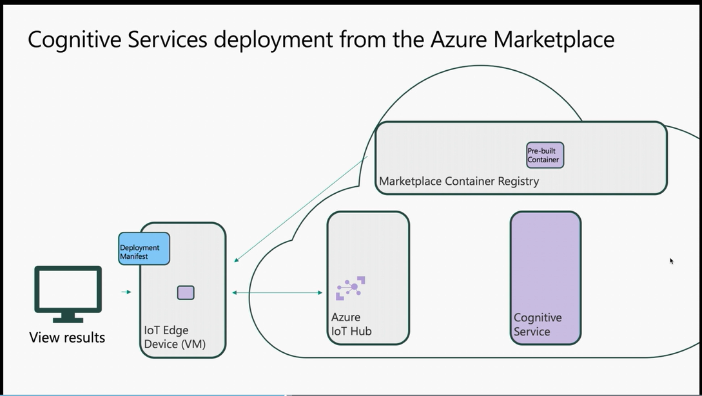
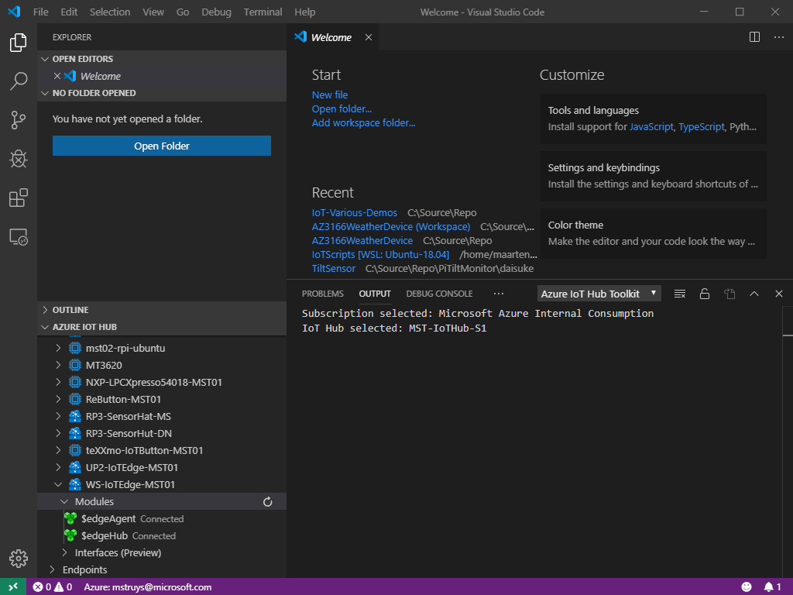
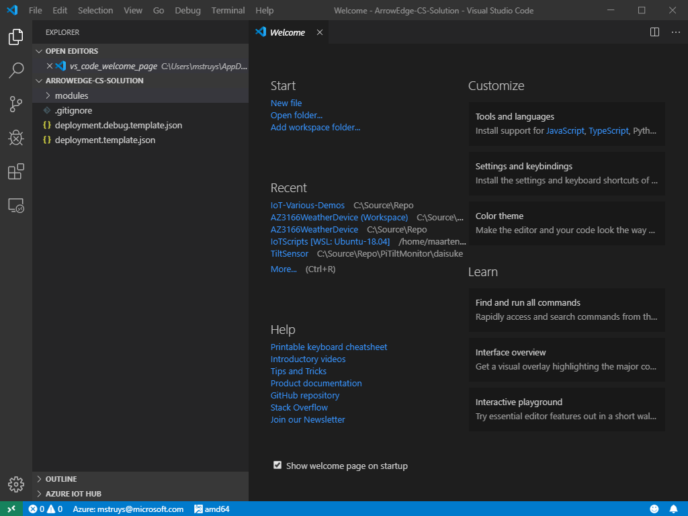
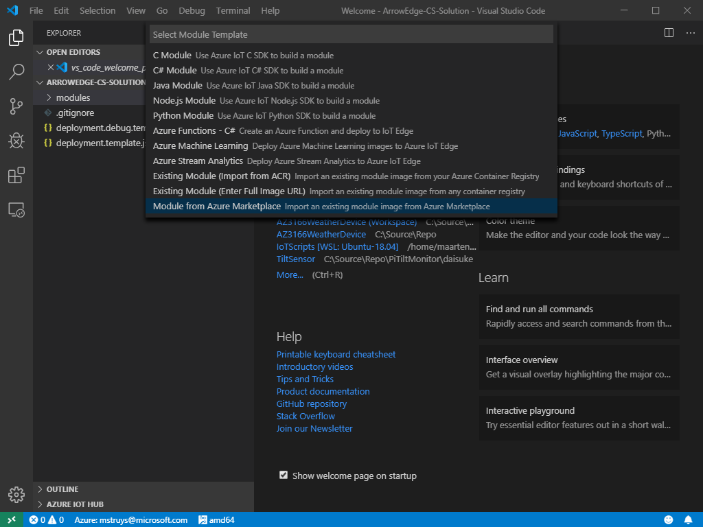
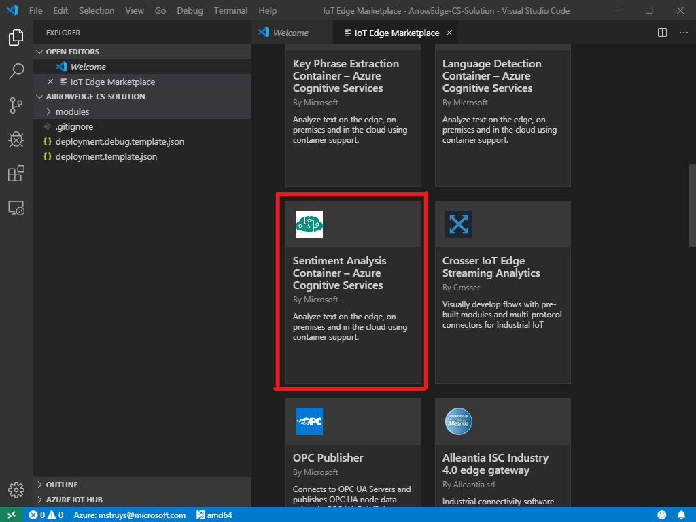
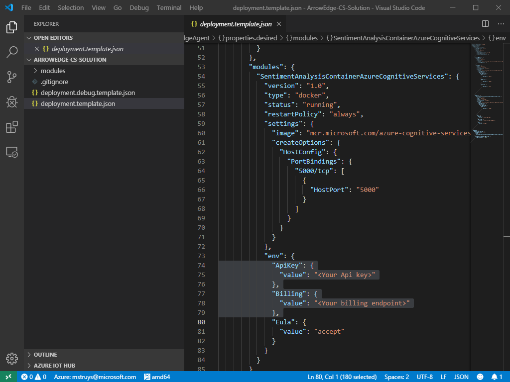
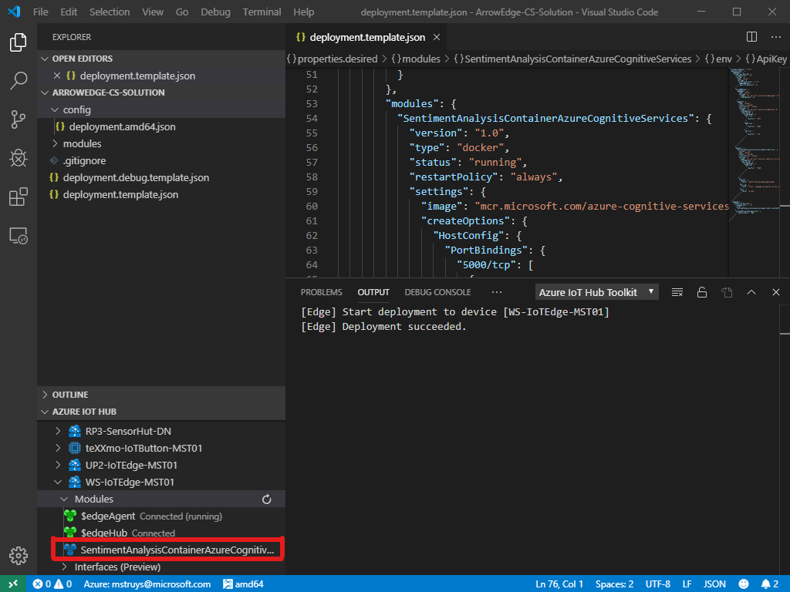

# Demo of Cognitive Services deployed via the Marketplace through VS Code

This demo has been shown at //Build 19. Take a look at the [following video](https://mybuild.techcommunity.microsoft.com/sessions/77054?source=sessions#top-anchor). The demo starts at 24:09.

High level architecture looks like this:



## Pre-requisites

Have the Azure IoT Edge runtime installed on one of the following:
- Physical device running Linux - [How to do this](https://docs.microsoft.com/en-us/azure/iot-edge/how-to-install-iot-edge-linux)
- Virtual device running Linux - [How to do this](https://docs.microsoft.com/en-us/azure/iot-edge/how-to-install-iot-edge-ubuntuvm)

	**NOTE**: If you install a virtual device from the Marketplace with IoT Edge already enabled, you will be asked to provide a connection string through a script. If the connection string passed is invalid, the IoT Edge runtime will fail. If you have issues, best to do is execute the following on the device:
	
```
	sudo iotedge list
	sudo iotedge check
```

The latter command will show you if there is something wrong with your connection string.
You also need to create an inbound security rule to open port 5000 for TCP traffic. 

**NOTE** If you are using an Azure VM that has been powered down, after restarting it might happen that you get errors if you are checking the number of modules in your edge device. If that happens, it is best to restart your container service and the iotedge runtime. This can be done as follows:

```
sudo systemctl restart docker
sudo systemctl restart iotedge
```

## Step-by-step instructions (Sentiment Analysis Cognitive Service)
1) Create a new Azure IoT Edge runtime on an Edge Device (virtual or physical) or use an existing one.

	**Note:** This step is not necessary if you use the 'Virtual device running Linux' or 'Virtual device running Windows Server' pre-requisites, since they already install the Azure IoT Edge runtime for you.
1) Start VS Code
1) Make sure to have an IoT Hub with an Edge device registered. This can be done using [these instructions](https://docs.microsoft.com/en-us/azure/iot-edge/how-to-register-device-vscode).
1) From inside VS Code, signin to Azure ()
1) From inside VS Code, select the Edge device that you previously registered. You should see the runtime already being active.

1) Create a new blank IoT Edge Solution inside VS Code

1) Right click the Modules folder and select **Add IoT Edge Module**
1) In the dropdown, select **Module from Azure Marketplace**

1) Scroll down to find the **Sentiment Analysis Container – Azure Cognitive Services** and Import it
	**NOTE:** This will only work properly from a local instance of Visual Studio Code. Don't use an instance that has a remote connection to your Edge device, because that will fail showing the Azure Marketplace.

1) Open the deployment.template.json and find the **SentimentAnalysisContainerAzureCognitiveServices** module

1) Enter your AppKey value, which you can find on your Azure Portal
1) Save the deployment.template.json file
1) Right-click on the deployment.template.json file and select **Generate IoT Edge Deployment Manifest**
1) Under the new created **config** section in your solution, right click the **deployment.amd64.json** file and select **Create Deployment for Single Device**
1) Select the Azure IoT Edge device to which you want to deploy the module and wait until it has been deployed.

1) Browse to the edge device to access the container (on port 5000)
	NOTE: You might need to create an inbound port rule on your VM's network to allow traffic to port 5000.
1) Use Swagger to try the service out.   

## Instructions to remove Azure IoT Edge runtime entirely
If you were using a Virtual device running Linux or a Virtual Device running Windows Server, according to the pre-requisites in this document, you can simply delete the Virtual Machine after your demo.

If you are using a physical device or a virtual device on which you installed the Azure IoT Runtime yourself, you can take the following steps to remove the Azure IoT Runtime.

- For Windows Devices use [this instruction](https://docs.microsoft.com/en-us/azure/iot-edge/how-to-install-iot-edge-windows#uninstall-iot-edge)
- For Linux Devices use [these istruction](https://docs.microsoft.com/en-us/azure/iot-edge/how-to-install-iot-edge-windows#uninstall-iot-edge)

