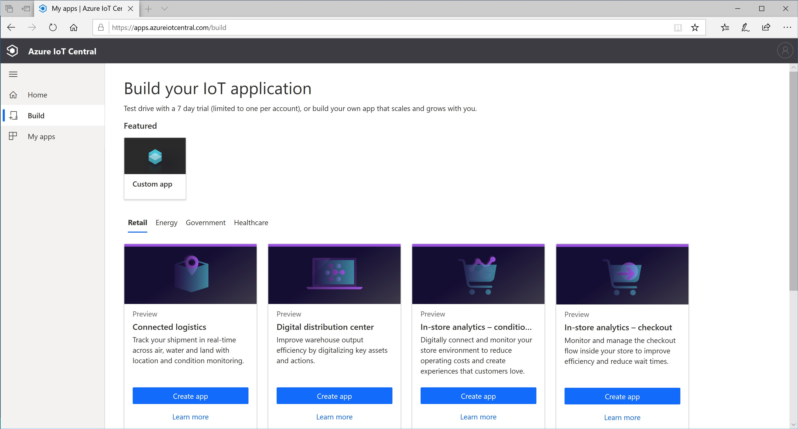
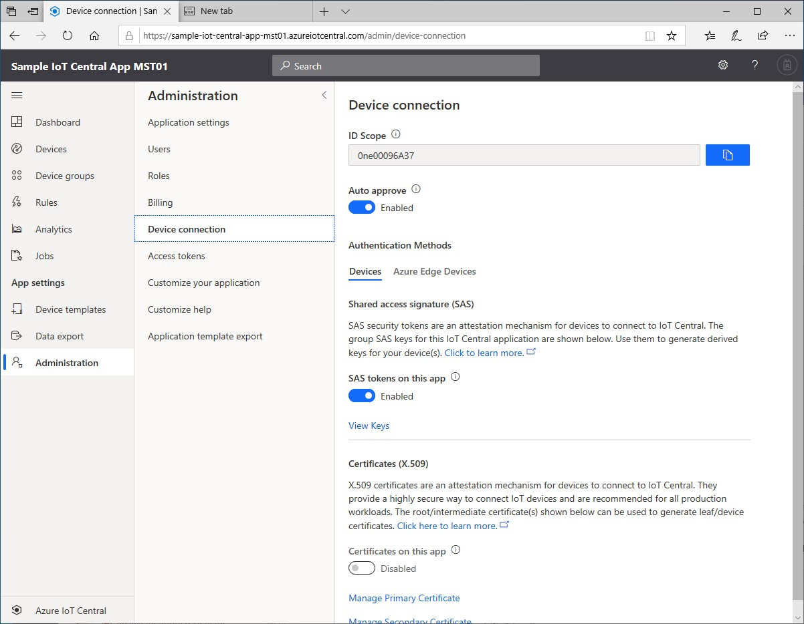

# IoT Plug and Play - Adding Devices Automatically
This is a very simple demo, showing how to add new devies to an IoT Central application. The devices should be IoT Plug and Play enabled in order to run this demo. The list of Iot Plug and Play devices will increase over future. Right now, the demo is based on either a SEEED rebutton device or an AZ3166 MXChip DevKit. Here are the step-by-step instructions to create a new Azure IoT Central application and add a device to it.
## Prerequisites
The IoT Device must have firmware that is IoT Plug and Play capable.
## Step-by-step Demo
1) Create a new Azure IoT Central Application (make sure to use the preview template and select a custom application)

2) When the application is created, go to the **Administration** tab and select **Device connection**. Copy the **ID Scope** and click the **View Keys** link to make a copy of the **Primary SAS Key**.

3) These values must be used to configure your device, as described in the [following document](https://docs.microsoft.com/en-us/azure/iot-central/preview/howto-connect-devkit). Connecting a SEEED rebutton device needs a simular configuration of the device, prior to be able to connect to an Azure IoT Central Application.
4) Reboot the device and make sure that your Azure IoT Central application is visible.
5) After a little bit of time (up to a minute), the device will show up in the **Devices** list. You might have to refresh the browser page in order to see the device appearing.
6) Click on the device that just appeared to see an initial device dashboard, that has been defined by the Device Builder as starting point for an IoT Solution.