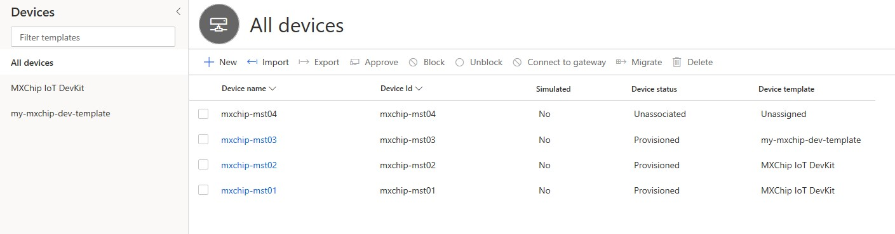

# Building an IoT Plug and Play enabled MXChip device - Connecting to an Azure IoT Central Application
This HOL is useful for device builders that want to support IoT Plug and Play to extend their potential customer base and to allow IoT Solution developers to concentrate on building a solution rather then connecting individual devices to an IoT Hub / IoT Central application.
## Prerequisites
Assuming you already finished the HOL to build your own IoT Plug and Play enabled device that connects to an IoT Hub, you don't need additional prerequisites to target MXChip devices with Visual Studio Code.
However, you do need an IoT Central application (choose any application template you like, for instance the custom template)
## Use a device capability model to create an IoT Plug and Play (simulated) device and connect it to your IoT Central application
You will now use a device capability model to create an IoT Plug and Play device. Even though we are using an MXChip DCM, initially we will run the device code as simulator in Windows. In order to run a simulated version of an MXChip device, follow the steps described in [this tutorial](https://docs.microsoft.com/en-us/azure/iot-central/preview/tutorial-connect-pnp-device). The tutorial contains a number of additional prerequisites. It is important this additional software on your development machine to be able to run the tutorial.
## Use a device capability model to create an IoT Plug and Play device (MXChip) and connect it to your IoT Central application
For the next part of this HOL we will target a real MXChip device. In the tutorial you ran earlier, repeat the steps to [Generate the C code stub](https://docs.microsoft.com/en-us/azure/iot-central/preview/tutorial-connect-pnp-device#generate-the-c-code-stub). However, this time select the **MXChip IoT DevKit project**.
You need to create a device with a different ID, and you also need to execute dps_keygen again to create a symetric key for this particular device. You can configure DPS credentials inside Visual Studio Code through a Workbench command. Also, in the generated stub code, no sensor readings are implemented. Similar to the previous HOL, you can implement sensor readings and command implementations in the source file **mxchip_iot_devkit_impl.c**. 
## Bonus step
Now you should also be able to use the capability model we created in the previous lab in a similar way to connect to an Azure IoT Central application. In order of your Device Capability Model To work with IoT Central, the device capability model must have all the interfaces defined inline in the same file. This is different from how we defined our DCM and interfaces in the very first HOL. Take a look at the public DCM for an MxChip IoT DevKit device that you downloaded previously to see how to define your interfaces inline in the DCM. You need to create a device with a different ID, and you also need to execute dps_keygen again to create a symetric key for this particular device. You can configure DPS credentials inside Visual Studio Code through a Workbench command. Also, in the generated stub code, no sensor readings are implemented. Similar to the previous HOL, you can implement sensor readings and command implementations in the source file **mxchip_iot_devkit_impl.c**.

When you connect this device to your IoT Central application, you will see that it is available under the devices tab as an unassociated device with an unassigned device template.

The reason for this is that the device template you are using is not publicly available, it is only defined locally on your development machine. In order to associate the device properly, what you can do is create a new device template inside your IoT Central application and import your local DCM to it. You can also select a default view to actually see telemetry data and have the capability to send commands from your device. Similar to the previous HOL, you can implement sensor readings and command implementations in the source file **mxchip_iot_devkit_impl.c** to get meaningfull telemetry and execute commands.

