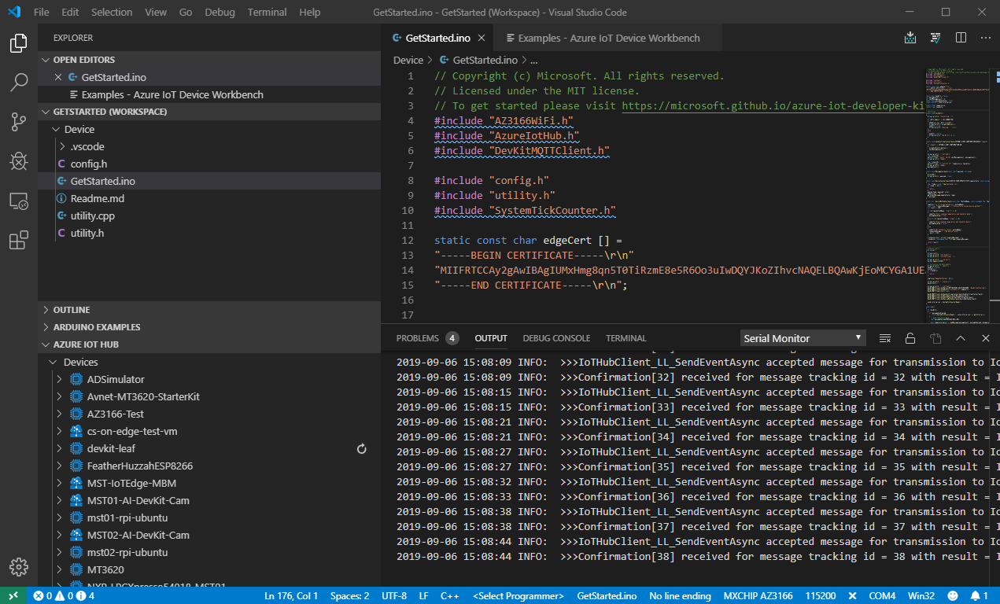
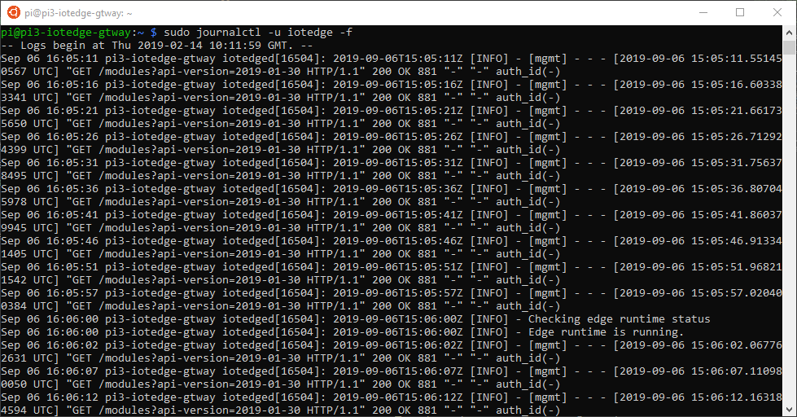

# Azure IoT Edge Device (RPi) as Transparent Gateway with connected MXChip Leaf Device

This demo allows you to show how to connect leaf devices to a transparent gateway device using Azure IoT Edge. We use a  Rasberry Pi 3B+ as gateway. More backgound information on using an Azure IoT Edge as a Gateway (transparent, protocol translation, identity translation) can be [found here](https://docs.microsoft.com/en-us/azure/iot-edge/iot-edge-as-gateway).

## Pre-requisites

Here you will find detailed instruction to install [Azure IoT Edge on a RP3 running Raspbian Buster](../Generic-prerequisites/Raspbian-Buster-IoTEdge-RP3/README.md).

## Generate certificates with Linux

A good description on doing this can be found in [this document](https://docs.microsoft.com/en-us/azure/iot-edge/how-to-create-transparent-gateway#generate-certificates-with-linux) (for my personal use: WSL on work laptop has generated keys in the ~/IoTEdgeCerts folder).

To copy the generated certificates from a development machine to the target device, you can use the following commands from a WSL shell:
```Bash
    scp <root-folder-for-cert-creation>/certs/iot-edge-device-ca-MyEdgeDeviceCA-full-chain.cert.pem pi@<remote-host>:<CERTDIR>/certs/
    scp <root-folder-for-cert-creation>/private/iot-edge-device-ca-MyEdgeDeviceCA.key.pem pi@<remote-host>:<CERTDIR>/private/
    scp <root-folder-for-cert-creation>/certs/azure-iot-test-only.root.ca.cert.pem pi@<remote-host>:<CERTDIR>/certs
```

On the Edge device you now must add the certificates to the certificate section of the IoT Edge security daemon file that can be found here: ```/etc/iotedge/config.yaml```

If you are using an IP address to refer to your Azure IoT Edge device, make sure that this is set properly in the Hostname entry in the IoT Edge security daemon file as well.

Sample hostname contents of the IoT Edge security daemon file:

```YAML
# Edge device hostname
###############################################################################                                         #
# Configures the environment variable 'IOTEDGE_GATEWAYHOSTNAME' injected into                                           # modules. Regardless of case the hostname is specified below, a lower case
# value is used to configure the Edge Hub server hostname as well as the                                                # environment variable specified above.                                                                                 #                                                                                                                       # It is important to note that when connecting downstream devices to the                                                # Edge Hub that the lower case value of this hostname be used in the
# 'GatewayHostName' field of the device's connection string URI.                                                        ###############################################################################
                                                                                                                        #hostname: "pi3-iotedge-gtway"
hostname: "192.168.2.22"
```

To be able to use the Azure IoT Edge runtime for transparent gateway use, no additional modules are necessary, but both the edgeAgent and the edgeHub must be running. Initially, only the edgeAgent will be running. You can use the Azure Portal to do this as follows:

1) In the Azure portal, navigate to your IoT hub.
1) Go to **IoT Edge** and select your IoT Edge device that you want to use as a gateway.
1) Select **Set Modules**.
1) Select **Next**.
1) In the **Specify routes** page, you should have a default route that sends all messages from all modules to IoT Hub. If not, add the following code then select **Next**.
```JSON
{
    "routes": {
        "route": "FROM /* INTO $upstream"
    }
}
```
6) In the Review template page, select **Submit**.

Now you can verify if both the edgeAgent and the edgeHub are running on your Iot Edge device by using the following command: ```sudo iotedge list```. If you still only see the edgeAgent, restart the IoT Edge runtime by: ```sudo iotedge restart```.

## Using the MXChip IoT DevKit as leaf device
The easiest way to set this up is by using the **Get Started** sample that is part of the **IoT Device Workbench Examples**.

1) Select an existing IoT Hub and create a new device, for instance by typing **Azure IoT Hub: Create Device** in Visual Studio Code's command palette.
1) Give the device an appropriate name
1) Right click on the just created device and select **Copy Device Connection String** to copy the connection string to the clipboard.
1) Put the IoT DevKit into **Configuration Mode** by holding button **A** while pushing and releasing the **Reset** button.
1) Open the command palette and select **Azure IoT Device Workbench: Configure Device Settings**
1) Select to an **Input IoT Hub Device Connection String** and paste the contents of the clipboard.
1) Append teh GatewayHostName property with the hostname or IP address of the gateway device to the end of the connection string. The final string should look like this: ```Hostname=yourIoTHub.azure-devices.net;DeviceId=yourDevice;SharedAccessKey=XXXYYYZZZ=;GatewayHostName=hostname```
1) Press enter to set this into the MXChip IoT DevKit
1) Add a new **edgeCert** variable at the beginning of the GetStarted.ino file:
```C
static const  char edgeCert [] =
"-----BEGIN CERTIFICATE-----\r\n"
"Your CA string"            // No newlines in this, just one long string
"-----END CERTIFICATE-----\r\n";
```
10) Register the CA certificate when setting up the client by adding:
```C
DevKitMQTTClient_SetOption("TrustedCerts", edgeCert);
```

right after this already available statement:

```C
DevKitMQTTClient_SetOption(OPTION_MINI_SOLUTION_NAME, "DevKit-GetStarted");
```

Now you should be good to go. Just boot the MXChip IoT DevKit and make sure that the Edge Device is running as well. You will see messages arriving at the IoT Hub.

At the same time you will see in the IoT Edge logfiles that it passes those messages through.


**Possible Issues:** This should all work smoothly (even with a RPi connected only via WiFi). The only critical things are to make sure that both edgeAgent and edgeHub modules are running on the Edge Device and that the GatewayHostName is consistent (easiest to use IP addresses to stay away from potential DNS challenges)

## To try out: Route sensor data from DevKit to ASA
Take [this link to try this](https://docs.microsoft.com/en-us/azure/iot-edge/how-to-create-transparent-gateway#route-messages-from-downstream-devices). Should be possible to use exactly this routing info and feed that to ASA from MXChip if we get similar telemetry readings.

- Take the Raspberry Pi first as a leaf device
- Next step take MXChip

