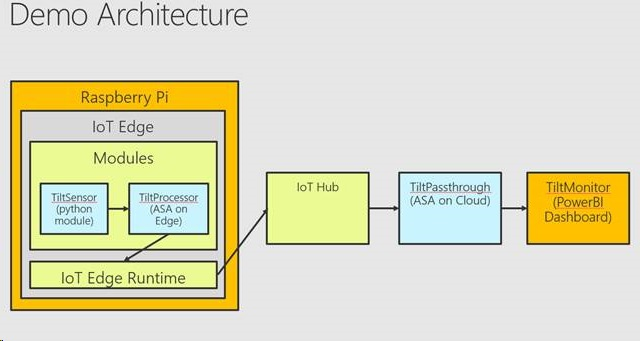
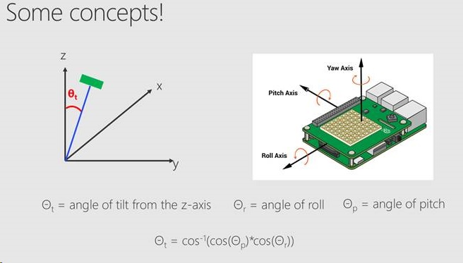

# Demo of Anomaly Detection Stream Analytics running on an Azure IoT Edge Device (RPi)

This demo allows you to show anomaly detection on the Edge using an Azure Stream Analytics Job that is executing on a Rasberry Pi 3B+. The device also contains a Sensor Hat for detecting tilt and providing visual feedback. The Tilt Monitor also uses a Power BI dashboard to show anomalies.

Some background on Anomaly Detection using ASA can be found in [this document](https://azure.microsoft.com/en-us/blog/anomaly-detection-using-built-in-machine-learning-models-in-azure-stream-analytics/).

## Pre-requisites

Here you will find detailed instruction to install [Azure IoT Edge on a RP3 running Raspbian Buster](../Generic-prerequisites/Raspbian-Buster-IoTEdge-RP3/README.md).

## High level demo description
This is a readily available demo with a sensor hat (contains LEDs) on a raspberry Pi. It uses pre-deployed A/D ML functions to ‘paint’ the hat in Red if there is vibration detected. The input to the on-the-edge stream processing uses the accelerometer input.

The demo also showcases the C# UDF capability in Stream Analytics. We ingress x,y,z coordinates and make a C# UDF call on the edge (beat that!!) to compute tilt using complex math function library in C# and run anomaly detection on that computed Tilt.

Some background of calculating tilt can be found in the following image.

For now, see [this description](https://dev.azure.com/mstruys-nl/_git/PiTiltMonitor?path=%2FREADME.md&version=GBmaster) to build the entire project. This repository (on which you are reading the README.md right now) is not complete with all projects, so they are currently pulled from a dev.azure.com repository.